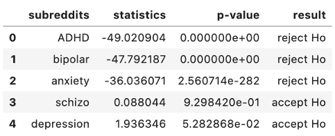
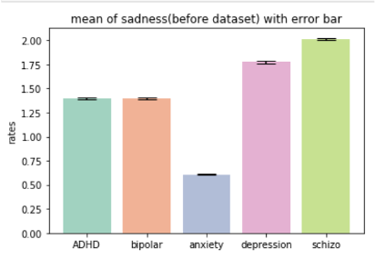

## 가설

정신질환 환자가 스스로의 정신질환을 인지하기 전과 후의 언어학적 차이가 존재할까?

-> 이를 검정하기 위해, 정신질환 subreddit에 처음으로 글을 작성하기 전과 후의 게시글을 비교

 

### 언어학적 특성

구체적인 도출 방법 및 성능평가는 `compare_with_LIWC`

- `Word count`: 게시글 중 단어의 개수 (얼마나 긴 글을 게시하는가)

- `Word per sentences`: 각 문장당 단어의 비율 (얼마나 긴 문장을 사용하는가)

- `Sixltr`: 6글자 이상의 단어의 비율 (얼마나 긴 단어를 사용하는가)

- `Sentimental analysis`: 게시글의 긍부정적 정도 (positive, negative)

- `Sentimental classifications`: 게시글의 감정의 종류별 정도  (anger, fear, sadness, joy, trust, anticipation, disgust)

- `Pronouns Analysis`: 게시글 내의 인칭대명사의 비율 (1인칭대명사, 2인칭대명사, 3인칭대명사, 비인칭대명사)

- `Time-oriented Analysis`: 게시글에서 언급하는 시제 (과거, 현재, 미래)

### 사용할 data

- before dataset
  - `analysis_between_subreddits.ipynb`의 `mental-health dataset`의 각 author가 최초로 해당 subreddit에 글을 작성한 날짜를 기준으로 2년 동안 전체 subreddit에 작성한 글들을 수집

- after dataset

  - `analysis_between_subreddits.ipynb`의 `mental-health dataset`의 각 author가 최초로 해당 subreddit에 글을 작성한 날짜부터, 데이터 수집 시기(2020-09) 까지 전체 subreddit에 작성한 글들을 수집

 

## 결과

1. `Word count`: 게시글 중 단어의 개수 (얼마나 긴 글을 게시하는가)

    1) plot for mean of before & after dataset

      - before

      - after

    2) compare distribution with chi-square analysis

    - Ho: origin dataset에서의 word count 분포가 before dataset에서의 분포와 같다.

-> 각 before data와 origin data의 word count 분포는 schizophrenia subreddit의 사용자를 제외하고는 유의미한 차이를 갖는다. (reject Ho)

- Ho: origin dataset에서의 word count 분포가 after dataset에서의 분포와 같다.

-> 각 after data와 origin data의 word count 분포는 schizophrenia subreddit의 사용자를 제외하고는 유의미한 차이를 갖는다. (reject Ho)

 

2. `Word per sentences`: 각 문장당 단어의 비율 (얼마나 긴 문장을 사용하는가)

  1) plot for mean of before & after dataset

  - before

  - after

2) compare with t-test

해당 데이터는 Central Limit theorem에 의해 정규분포로 가정할 수 있다. 따라서, 이분산 조건에서의 t test를 이용해 아래 귀무가설을 검정할 수 있다.

- Ho: before data 과 after data의 origin dataset에서의 word per sentence 의 mean은 같다.

-> before, origin data에서의 word per sentence의 mean은 anxiety subreddit의 사용자의 경우 같지 않음을 알 수 있다. (reject Ho) 따라서 anxiety subreddit의 사용자 본인이 정신질환을 인지하기 전과 후의 문장의 호흡 길이 (word per sentence) 는 다르다.  

 

3. `Sixltr`: 6글자 이상의 단어의 비율 (얼마나 긴 단어를 사용하는가)

1) plot for mean of before & after dataset

- before

- after

2) compare with t-test

해당 데이터는 Central Limit theorem에 의해 정규분포로 가정할 수 있다. 따라서, 이분산 조건에서의 t test를 이용해 아래 귀무가설을 검정할 수 있다.

- Ho: before data 과 after data의 origin dataset에서의 sixltr 의 mean은 같다.

-> before, origin data에서의 Sixltr의 mean은 대부분 같지 않음을 알 수 있다. (reject Ho) 따라서 anxiety, schizophrenia subreddit의 사용자를 제외하고는 사용자 본인이 정신질환을 인지하기 전과 후의 길이가 긴 단어를 사용하는 비율(Sixltr)은 다르다.

 

4. `Sentimental analysis`: 게시글의 긍부정적 정도 (positive, negative)

   1) positive

   (1) plot for mean of before & after dataset

   - before

   - after

   (2) compare with t-test

   해당 데이터는 Central Limit theorem에 의해 정규분포로 가정할 수 있다. 따라서, 이분산 조건에서의 t test를 이용해 아래 귀무가설을 검정할 수 있다.

   - Ho: before data 과 after data의 origin dataset에서의 positive 의 mean은 같다.

    

   2) negative

   (1) plot for mean of before & after dataset

   - before

   - after

   (2) compare with t-test

   해당 데이터는 Central Limit theorem에 의해 정규분포로 가정할 수 있다. 따라서, 이분산 조건에서의 t test를 이용해 아래 귀무가설을 검정할 수 있다.

   - Ho: before data 과 after data의 origin dataset에서의 negative rate 의 mean은 같다.

   -> before, origin data에서의 sentimental analysis 의 mean은 대부분 같지 않음을 알 수 있다. (reject Ho) 따라서 schizophrenia과, depression subreddit의 사용자를 제외하고는 긍정적 감정을 제외하고, 사용자 본인이 정신질환을 인지하기 전과 후의 글에서 나타나는 긍정적 감정, 부정적 감정은 다르다.  

    

5. `Sentimental classifications`: 게시글의 감정의 종류별 정도  (anger, fear, sadness, joy, trust, anticipation, disgust)

  1) anger

  (1) plot for mean of before & after dataset

  - before

  - after

  (2) compare with t-test

  해당 데이터는 Central Limit theorem에 의해 정규분포로 가정할 수 있다. 따라서, 이분산 조건에서의 t test를 이용해 아래 귀무가설을 검정할 수 있다.

  - Ho: before data 과 after data의 origin dataset에서의 anger rate 의 mean은 같다.

   

  2) fear

  (1) plot for mean of before & after dataset

  - before

  

  - after

  

  (2) compare with t-test

  해당 데이터는 Central Limit theorem에 의해 정규분포로 가정할 수 있다. 따라서, 이분산 조건에서의 t test를 이용해 아래 귀무가설을 검정할 수 있다.

  - Ho: before data 과 after data의 origin dataset에서의 fear 의 mean은 같다.

  

   

  3) sadness

  (1) plot for mean of before & after dataset

  - before

  - after

  (2) compare with t-test

  해당 데이터는 Central Limit theorem에 의해 정규분포로 가정할 수 있다. 따라서, 이분산 조건에서의 t test를 이용해 아래 귀무가설을 검정할 수 있다.

  - Ho: before data 과 after data의 origin dataset에서의 sadness 의 mean은 같다.

   

  4) joy

  (1) plot for mean of before & after dataset

  - before

  - after

  (2) compare with t-test

  해당 데이터는 Central Limit theorem에 의해 정규분포로 가정할 수 있다. 따라서, 이분산 조건에서의 t test를 이용해 아래 귀무가설을 검정할 수 있다.

  - Ho: before data 과 after data의 origin dataset에서의 joy 의 mean은 같다.

   

  5) trust

  (1) plot for mean of before & after dataset

  - before

  - after

  (2) compare with t-test

  해당 데이터는 Central Limit theorem에 의해 정규분포로 가정할 수 있다. 따라서, 이분산 조건에서의 t test를 이용해 아래 귀무가설을 검정할 수 있다.

  - Ho: before data 과 after data의 origin dataset에서의 trust rate 의 mean은 같다.

  -> before, origin data에서의

   

  6) anticipation

  (1) plot for mean of before & after dataset

  - before

  - after

  (2) compare with t-test

  해당 데이터는 Central Limit theorem에 의해 정규분포로 가정할 수 있다. 따라서, 이분산 조건에서의 t test를 이용해 아래 귀무가설을 검정할 수 있다.

  - Ho: before data 과 after data의 origin dataset에서의 anticipation rate 의 mean은 같다.

   

  7) disgust

  (1) plot for mean of before & after dataset

  - before

  - after

  (2) compare with t-test

  해당 데이터는 Central Limit theorem에 의해 정규분포로 가정할 수 있다. 따라서, 이분산 조건에서의 t test를 이용해 아래 귀무가설을 검정할 수 있다.

  - Ho: before data 과 after data의 origin dataset에서의 disgust rate 의 mean은 같다.

   

  8) surprise

  (1) plot for mean of before & after dataset

  - before

  - after

  (2) compare with t-test

  해당 데이터는 Central Limit theorem에 의해 정규분포로 가정할 수 있다. 따라서, 이분산 조건에서의 t test를 이용해 아래 귀무가설을 검정할 수 있다.

  - Ho: before data 과 after data의 origin dataset에서의 surprise rate 의 mean은 같다.

-> before, origin data에서의 sentimental classification의 mean은 대부분 같지 않음을 알 수 있다. (reject Ho) 따라서 schizophrenia subreddit의 사용자가 느끼는 감정종류들과 depression subreddit의 사용자가 느끼는 trust rate를 제외하고는 사용자 본인이 정신질환을 인지하기 전과 후의 느끼는 각 감정의 정도가 다르다.

   

6. `Pronouns Analysis`: 게시글 내의 인칭대명사의 비율 (1인칭대명사, 2인칭대명사, 3인칭대명사, 비인칭대명사)

  1) 1pers(1인칭대명사)

  (1) plot for mean of before & after dataset

  - before

  - after

  (2) compare with t-test

  해당 데이터는 Central Limit theorem에 의해 정규분포로 가정할 수 있다. 따라서, 이분산 조건에서의 t test를 이용해 아래 귀무가설을 검정할 수 있다.

  - Ho: before data 과 after data의 origin dataset에서의 1인칭 대명사 비율의 mean은 같다.

   

  2) 2pers(2인칭대명사)

  (1) plot for mean of before & after dataset

  - before

  - after

  (2) compare with t-test

  해당 데이터는 Central Limit theorem에 의해 정규분포로 가정할 수 있다. 따라서, 이분산 조건에서의 t test를 이용해 아래 귀무가설을 검정할 수 있다.

  - Ho: before data 과 after data의 origin dataset에서의 2인칭 대명사 비율의 mean은 같다.

   

  3) 3pers(3인칭대명사)

  (1) plot for mean of before & after dataset

  - before

  - after

  (2) compare with t-test

  해당 데이터는 Central Limit theorem에 의해 정규분포로 가정할 수 있다. 따라서, 이분산 조건에서의 t test를 이용해 아래 귀무가설을 검정할 수 있다.

  - Ho: before data 과 after data의 origin dataset에서의 3인칭 대명사 비율의 mean은 같다.

   

  4) nonpers(비인칭대명사)

  (1) plot for mean of before & after dataset

  - before

  - after

  (2) compare with t-test

  해당 데이터는 Central Limit theorem에 의해 정규분포로 가정할 수 있다. 따라서, 이분산 조건에서의 t test를 이용해 아래 귀무가설을 검정할 수 있다.

  - Ho: before data 과 after data의 origin dataset에서의 비인칭 대명사 비율의 mean은 같다.

-> 서로 다른  subreddit data의 pronoun rate 의 mean은 같지 않음을 알 수 있다. (reject Ho) 따라서 schizophrenia subreddit의 사용자를 제외하고는 사용자 본인이 정신질환을 인지하기 전과 후의 각 인칭대명사의 사용 비율은 다르다.
   

7. `Time-oriented Analysis`: 게시글에서 언급하는 시제 (과거, 현재, 미래)

  1) 과거

  (1) plot for mean of before & after dataset

  - before

  - after

  (2) compare with t-test

  해당 데이터는 Central Limit theorem에 의해 정규분포로 가정할 수 있다. 따라서, 이분산 조건에서의 t test를 이용해 아래 귀무가설을 검정할 수 있다.

  - Ho: before data 과 after data의 origin dataset에서의 past rate 의 mean은 같다.

   

  2) 현재

  (1) plot for mean of before & after dataset

  - before

  - after

  (2) compare with t-test

  해당 데이터는 Central Limit theorem에 의해 정규분포로 가정할 수 있다. 따라서, 이분산 조건에서의 t test를 이용해 아래 귀무가설을 검정할 수 있다.

  - Ho: before data 과 after data의 origin dataset에서의 present rate 의 mean은 같다.

   

  3) 미래

  (1) plot for mean of before & after dataset

  - before

  - after

  (2) compare with t-test

  해당 데이터는 Central Limit theorem에 의해 정규분포로 가정할 수 있다. 따라서, 이분산 조건에서의 t test를 이용해 아래 귀무가설을 검정할 수 있다.

  - Ho: before data 과 after data의 origin dataset에서의 future rate 의 mean은 같다.

-> 서로 다른  subreddit data의 time rate 의 mean은 같지 않음을 알 수 있다.
(reject Ho) 따라서 schizophrenia subreddit의 사용자를 제외하고는, 사용자 본인이 정신질환을 인지하기 전과 후에 글에서 중심으로 하는 시점은 다르다.

 

## 분석

각 author의 subreddit별 차이를 관찰하기 위해 이분산 조건에서의 t-test를 진행하였는데, 각 subreddit끼리의 교차 테스트를 통해 각 특징의 항목별로 10번의(5C2) 검정을 수행하였다.  그 결과, schizophrenia의 모든 언어학적 특징, depression에서의 trust rate, anxiety의 Sixltr을 제외하고 모든 정신질환에서 정신질환을 인지하기 전과 후의 언어학적 차이가 유의미하게 나타났다. 이를 통해, 단순히 정신질환 subreddit과 non-mental-health subreddit에서의 언어학적 특성의 차이에서 subreddit의 종류가 conpounding variable이 아니라는 것을 알 수 있다. 즉 글의 주제와 무관하게 언어학적 특징의 차이가 존재함을 알 수 있다. 따라서 이후 각 언어학적 특징을 feature로 두고, 글의 작성자가 정신질환을 가지고 있는지를 예측하는 연구를 진행할 수 있을 것이다.

또 하나의 흥미로운 사실은 schizophrenia의 경우, 본인이 정신질환을 인지하기 전과 후의 언어학적 특성의 변화가 하나도 없다는 것이다. 이 경우 schizophrenia를 예측하는 연구를 진행할 때, 앞서 언급한 언어학적 특성 외 다른 특징을 feature로 삼아야 할 것이다.
