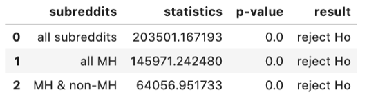

## 가설

정신질환 subreddit의 게시글들과 일반 subreddit의 게시글들의 언어학적 차이가 존재할까?

-> 이를 검정하기 위해, 5가지 정신질환 subreddit의 글과 6가지 일반 subreddit의 글을 비교

 

### 언어학적 특성

구체적인 도출 방법 및 성능평가는 `compare_with_LIWC`

- `Word count`: 게시글 중 단어의 개수 (얼마나 긴 글을 게시하는가)

- `Word per sentences`: 각 문장당 단어의 비율 (얼마나 긴 문장을 사용하는가)

- `Sixltr`: 6글자 이상의 단어의 비율 (얼마나 긴 단어를 사용하는가)

- `Sentimental analysis`: 게시글의 긍부정적 정도 (positive, negative)

- `Sentimental classifications`: 게시글의 감정의 종류별 정도  (anger, fear, sadness, joy, trust, anticipation, disgust)

- `Pronouns Analysis`: 게시글 내의 인칭대명사의 비율 (1인칭대명사, 2인칭대명사, 3인칭대명사, 비인칭대명사)

- `Time-oriented Analysis`: 게시글에서 언급하는 시제 (과거, 현재, 미래)

### 사용할 data

- mental-health dataset

    - ADHD, anxiety, schizophrenia, bipolar, depression과 같은 정신질환 subreddit의 게시글들 중 10번 이상 글을 작성한 ID의 글들  (2015-09 ~ 2020- 09)

- non-mental health dataset

    - meditation, joke, parenting, fitness, parenting, relationship, teaching의 subreddit의 게시글들 (2015-09 ~ 2020-09)

 

## 결과

1. `Word count`: 게시글 중 단어의 개수 (얼마나 긴 글을 게시하는가)

  - Normality test 1 with D'Agostino-Pearson normality test (alpha = 0.05)

  -  Homogeneity of variance test 2 with levene test (alpha = 0.05)

  둘다 reject 이므로, Nonparametric chi-square test 진행

  - Ho: 각 subreddit의 word count 분포가 non-mental-health subreddit에서의 분포와 같다.

-> 정신질환 subreddit들의 word count 분포는 non-mental-health subreddit의 word count 분포와 유의미한 차이를 보임을 알 수 있다. (reject Ho)

이번에는 각 subreddit들끼리의 분포에 대해 아래와 같이 chi-square test를 진행하였다.

 - Ho: 각 subreddit의 word count 분포가 서로 같다.

-> 각 subreddit들끼리의 word count 분포도 서로 유의미한 차이를 보임을 알 수 있다. (reject Ho)

 

2. `Word per sentences`: 각 문장당 단어의 비율 (얼마나 긴 문장을 사용하는가)

  - Normality test 1 with D'Agostino-Pearson normality test (alpha = 0.05)

  -  Homogeneity of variance test 2 with levene test (alpha = 0.05)

  둘다 reject 이므로, Nonparametric Kruskal-Wallis test (alpha = 0.05) 를 통해 각 분포를 비교

  - Ho: 모든 subreddit data의 word per sentence 의 median은 같다.

-> 모든 subreddit data의 word per sentence의 median은 통계학적으로 다르다는 것을 알 수 있다. (reject Ho)

이번에는 각 subreddit 끼리의 word per sentence의 median을 비교했다. 이때, Man-Whitney U test 를 이용하였으며, Bonferroni correction을 적용하였다. (alpha = 0.05/6)

- Ho: 서로 다른 두 subreddit data의 word per sentence 의 median은 같다.

-> 서로 다른  subreddit data의 word per sentence의 median은 다르다는 것을 알 수 있다. (reject Ho)

해당 데이터는 등분산 조건을 만족하지는 못했지만, Central Limit theorem에 의해 정규분포로 가정할 수 있다.

따라서, 이분산 조건에서의 t test를 이용해 아래 귀무가설을 검정할 수 있다.

- Ho: 서로 다른 두 subreddit data의 word per sentence 의 mean은 같다.

-> 서로 다른  subreddit data의 word per sentence의 mean은 대부분 차이가 있음을 알 수 있다. (reject Ho)

 

3. `Sixltr`: 6글자 이상의 단어의 비율 (얼마나 긴 단어를 사용하는가)

 

4. `Sentimental analysis`: 게시글의 긍부정적 정도 (positive, negative)

   1) positive

   2) negative

 

5. `Sentimental classifications`: 게시글의 감정의 종류별 정도  (anger, fear, sadness, joy, trust, anticipation, disgust)

  1) anger

  2) fear

  3) sadness

  4) joy

  5) trust

  6) anticipation

  7) disgust

 

6. `Pronouns Analysis`: 게시글 내의 인칭대명사의 비율 (1인칭대명사, 2인칭대명사, 3인칭대명사, 비인칭대명사)

  1) 1pers(1인칭대명사)

  2) 2pers(2인칭대명사)

  3) 3pers(3인칭대명사)

  4) nonpers(비인칭대명사)

 

7. `Time-oriented Analysis`: 게시글에서 언급하는 시제 (과거, 현재, 미래)

  1) 과거

  2) 현재

  3) 미래

 

 

## 분석

우선 각 subreddit에서의 origin dataset의 언어학적 특징(word count, WPS, sixltr, sentimental analysis, sentimental classification, pronouns analysis, time-oriented analysis) 결과는 모두 정규성(pearson test, alpha = 0.05)과 등분산 조건(levene test, alpha=0.05)을 만족하지 못한다. 따라서 Kruskal-Wallis test(alpha = 0.05)로 각 subreddit에 대해 각 특별로 median을 비교하였다. 그 결과 모든 subreddit의 모든 언어학적 특성에서 유의미한 차이를 보였다(reject Ho). 사용하는 단어의 개수(word count), 긴 호흡의 문장을 구사하는 능력(word per sentence), 긴 단어를 사용하는 비율(sixltr), 감정의 긍부정 정도(sentimental analysis), 느끼는 감정의 종류(sentimental classification), 사용하는 인칭대명사의 종류 및 비율(pronouns analysis), 글에서 도드라지게 나타나는 시점(time oriented analysis)등등의 연어학적 차이가, 각 정신질환 subreddit들끼리의 유의미한 차이를 가지며, 전체 정신질환 subreddit 게시글과 non-mental health subreddit 게시글간에도 유의미한 차이를 보였다.

이후 각 subreddit끼리의 교차 테스트를 통해, 각 특징의 항목별로 15번의(6C2) Man-whitney U test(alpha = 0.05, Bonferroni correction with 6 groups) 을 통해 세부적인 차이를 관찰했다. 그 결과 대부분의 경우에서 각 subreddit끼리의 유의미한 차이가 존재하였다. (예외적으로 schizophrenia와 nonMH의 Sixltr, depression과 nonMH의 sadness rate, ADHD와 bipolar의 1인칭대명사 분석, ADHD와 schizophrenia의 trust, joy, surprise rate, anxiety와 schizophrenia의 Sixltr, past analysis, anxiety와 depression의 future analysis, anxiety와 schizophrenia의 disgust rate, bipolar와 depression에서의 anticipation rate, positive rate, depression과 schizophrenia의 비인칭대명사 분석에서는 유의미한 차이를 발견하지 못했다.) 마찬가지로, Kruskal-Wallis test에서의 결과로 나타났던 차이점들이 특정 정신질환 subreddit의 게시글 간, 또는 정신질환 subreddit과 non-mental health subreddit의 게시글 간에도 나타난다. (예외 부분 제외)

또한 sample size가 충분히 커서 Central Limit theorem에 의해 정규성을 띈다고 추론할 수 있으므로, 각 subreddit끼리의 교차 테스트를 통해, 각 특징의 항목별로 15번의(6C2) 이분산 조건에서의 t-test도 진행하였다. 그 결과 대부분의 경우에서 각 subreddit끼리의 유의미한 차이가 존재하였다. (예외적으로 ADHD와 nonMH의 anger rate, ADHD와 anxiety에서의 joy rate, ADHD와 schizophrenia에서의 WPS, positive rate, anticipation rate, ADHD와 depression의 positive rate, anxiety와 schizophrenia의 Sixltr, future analysis, anxiety와 depression에서의 2인칭대명사 분석, ADHD와 bipolar의 3인칭대명사분석, depression과 schizophrenia의 positive rate, trust rate, 비인칭대명사분석에서는 유의미한 차이를 발견하지 못했다.) 각 정신질환 subreddit들의 다양한 언어학적 특성들을 교차 테스트로 모두 비교함으로서, 단일 정신질환을 대조군과 비교한 기존 연구들의 한계를 극복하고자 했다.
