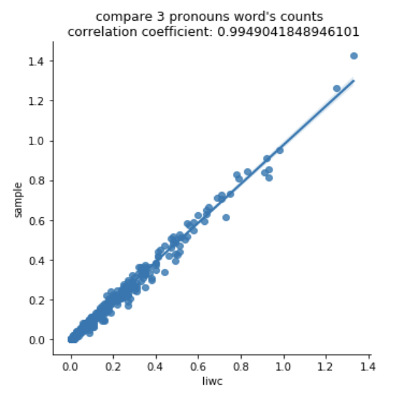

## Summary

아래와 같은 언어학적 특성 도출을 위해, 가장 많이 쓰이고 있는 software 인 [LIWC](http://liwc.wpengine.com/)를 벤치마킹 하였다.

- `Word count`: 게시글 중 단어의 개수 (얼마나 긴 글을 게시하는가)

- `Word per sentences`: 각 문장당 단어의 비율 (얼마나 긴 문장을 사용하는가)

- `Sixltr`: 6글자 이상의 단어의 비율 (얼마나 긴 단어를 사용하는가)

- `Sentimental analysis`: 게시글의 긍부정적 정도 (positive, negative)

- `Sentimental classifications`: 게시글의 감정의 종류별 정도  (anger, fear, sadness, joy, trust, anticipation, disgust)

- `Pronouns Analysis`: 게시글 내의 인칭대명사의 비율 (1인칭대명사, 2인칭대명사, 3인칭대명사, 비인칭대명사)

- `Time-oriented Analysis`: 게시글에서 언급하는 시제 (과거, 현재, 미래)

이 중 , `Word count`, `Word per sentences`, `Sixltr`, `Sentimental analysis`, `Sentimental classifications`은 [LIWC-alike](https://rdrr.io/github/kbenoit/LIWCalike/man/liwcalike.html)를 이용하였으며,  `Pronouns Analysis`, `Time-oriented Analysis`는 자체적으로 구축한 lexicon을 이용하였다.

수집한 mental-health dataset의 1000개를 추린 `sanity data`를 바탕으로 liwc와의 결과를 비교하였다.

 

1. `Word count`: 게시글 중 단어의 개수 (얼마나 긴 글을 게시하는가)

2. `Word per sentences`: 각 문장당 단어의 비율 (얼마나 긴 문장을 사용하는가)

3. `Sixltr`: 6글자 이상의 단어의 비율 (얼마나 긴 단어를 사용하는가)

4. `Sentimental analysis`: 게시글의 긍부정적 정도 (positive, negative)

5. `Sentimental classifications`: 게시글의 감정의 종류별 정도  (anger, fear, sadness, joy, trust, anticipation, disgust)

6. `Pronouns Analysis`: 게시글 내의 인칭대명사의 비율 (1인칭대명사, 2인칭대명사, 3인칭대명사, 비인칭대명사)

7. `Time-oriented Analysis`: 게시글에서 언급하는 시제 (과거, 현재, 미래)

  1) past

  2) present

  3) future

 
